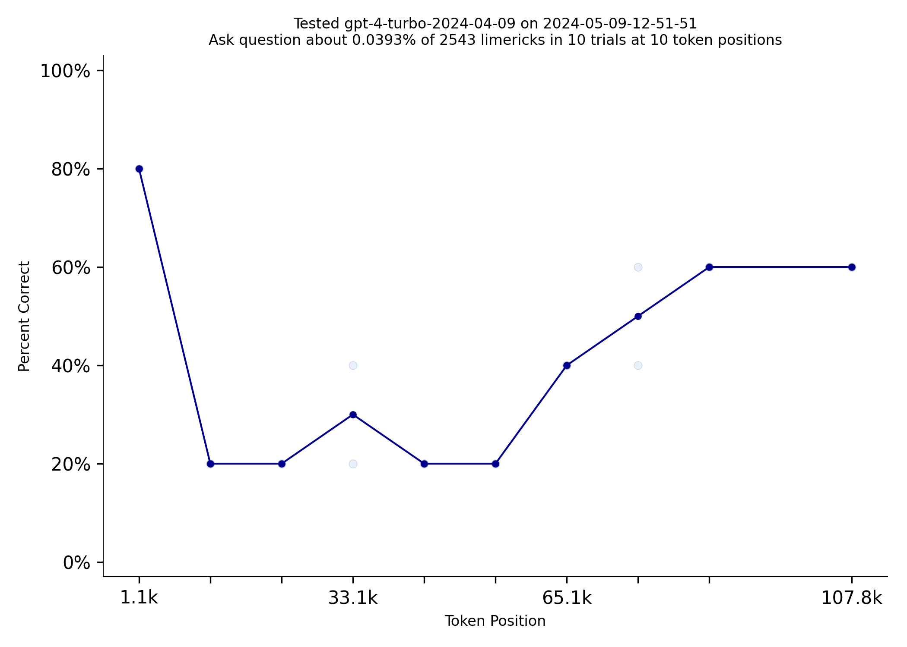
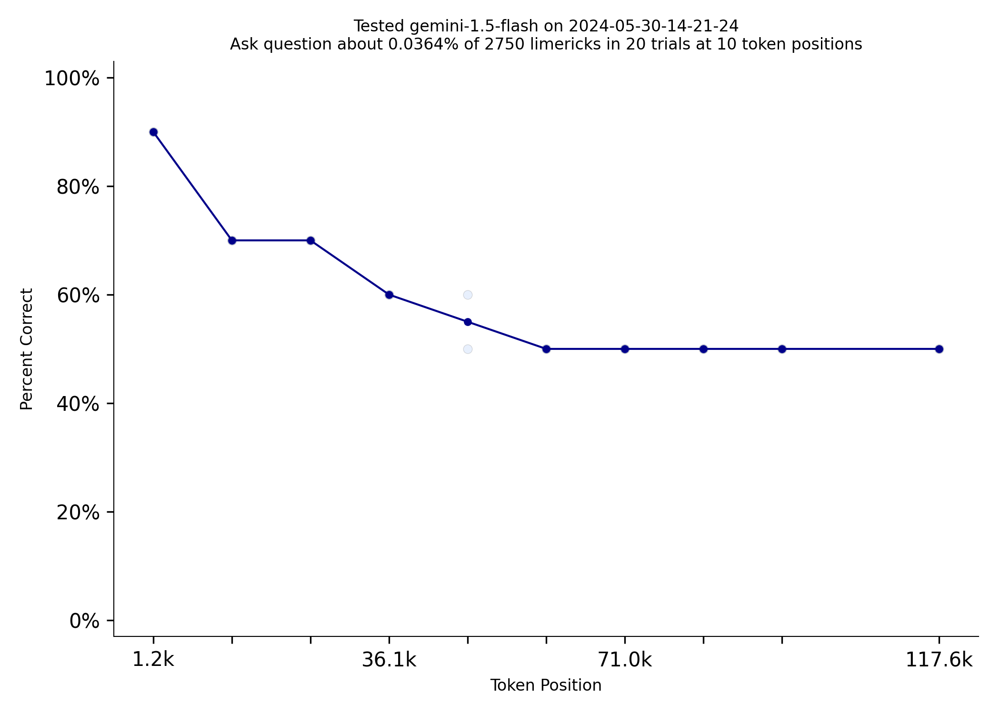
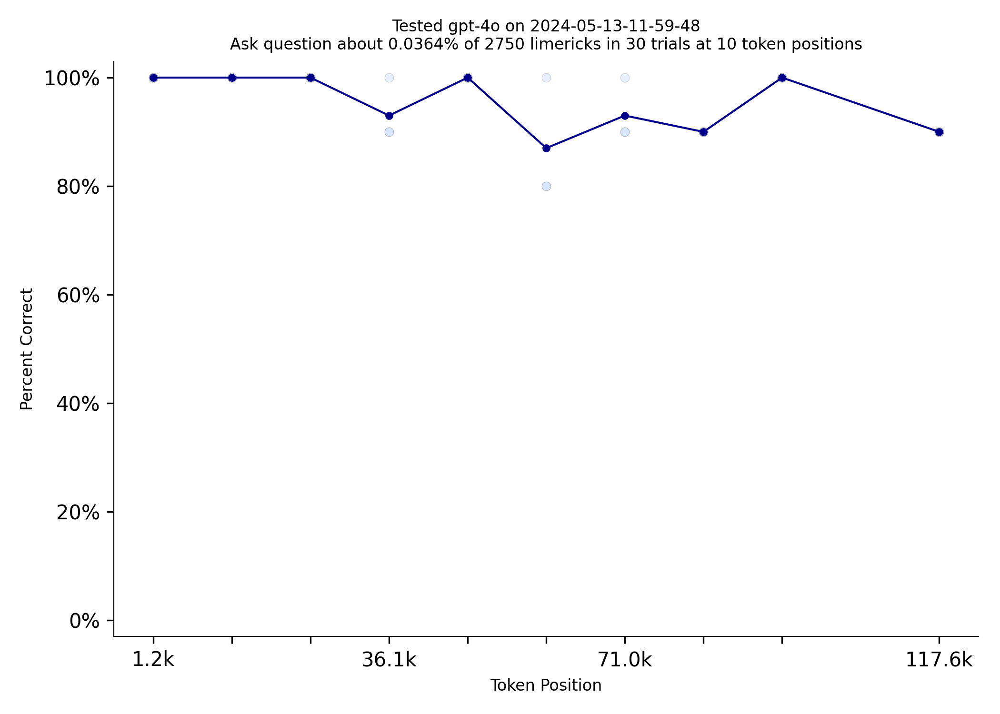
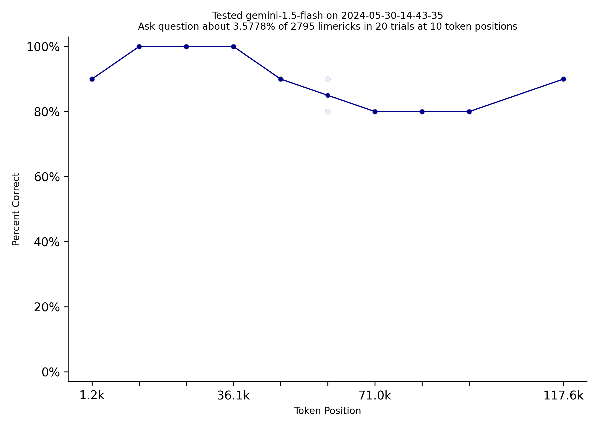

# Gemini 1.5 Flash Outperforms Much More Expensive Models
*by [Tom Burns](mailto:public@llmonpy.ai)*   
Needle in a Needlestack is a new benchmark to measure how well LLMs pay attention to the information in their context
window.  NIAN creates a prompt that includes thousands of limericks and the prompt asks a question about one limerick
at a specific location.  Here is an example prompt that [includes 2500ish limericks.](1/prompt.txt)  With the general
release of the Gemini 1.5 models, I tested them out on this benchmark today.  Gemini 1.5 Flash outperformed much more
expensive models like GPT-4 Turbo:   

|  |  |
|:----------------------------------:|:------------------------------------------------:|
|  gpt-4-turbo-2024-04-09            |             gemini-1.5-flash                     |

  
Gemini 1.5 Pro does really well on NIAN.  The only model that can match it is GPT-4o   

|  |  |
|:------------------------------------:|:--------------------------------------------:|
|                gpt-4o                |                gemini-1.5-pro                |

  
Repeating information can make a very big difference on this test.  Gemini Flash does dramatically better when the
limerick the prompt asks about is repeated 100 times.  It nearly matches Gemini Pro.   

|  |  |
|:---------------------------------------:|:-------------------------------------------------:|
|     Gemini Flash Limerick Used Once     |       Gemini Flash Limerick Used 100 Times        |

  
The [code for this benchmark is here.](https://github.com/llmonpy/needle-in-a-needlestack)  It should be
easy to add support for additional models.  You can [read more about how answers are evaluated and questions are
vetted on the methodology page](https://nian.llmonpy.ai/methodology).  If you have any questions, please [contact me](mailto:public@llmonpy.ai)