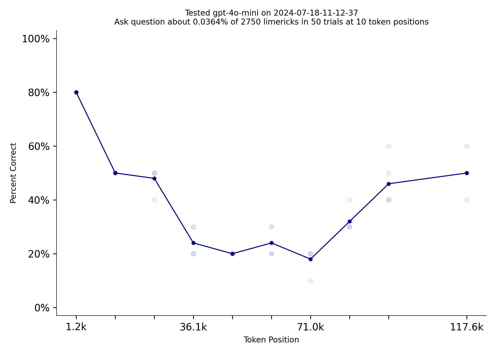
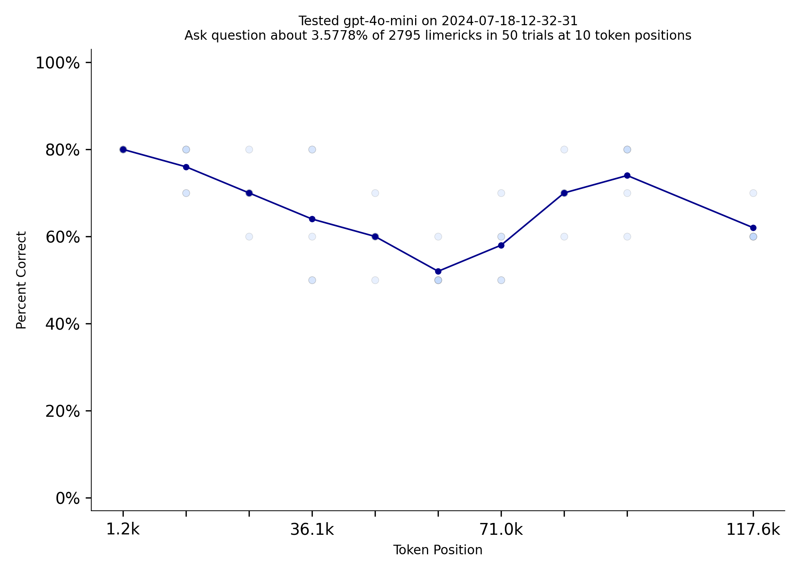

# GPT4o-mini comparable to GPT-4 Turbo, for 98.5% lower price
*by [Tom Burns](mailto:public@llmonpy.ai)*   
Needle in a Needlestack is a new benchmark to measure how well LLMs pay attention to the information in their context
window.  NIAN creates a prompt that includes thousands of limericks and the prompt asks a question about one limerick
at a specific location.  Here is an example prompt that [includes 2500ish limericks.](1/prompt.txt)  The new OpenAI model, 
GPT-4o-mini, is comparable to GPT-4 Turbo on this benchmark but costs $0.15/million input tokens vs $10.00 for
turbo. 4o-mini is also 70% cheaper than GPT-3.5-turbo and 4o-mini has a 4 times larger context window.

|  |  |
|:----------------------------------:|:---------------------------------------:|
|       gpt-4-turbo-2024-04-09       |               gpt-4o-mini               |

  
4o-mini does substantially worse than flash, but flash costs more than twice as much ($0.35/million tokens).  The
4o-mini rate limits are 10 times higher (10k requests per minute) than gemini-flash too.  I gotta say, I really love
gemini-flash, but I am excited to use 4o-mini with [LLMonPy](https://github.com/llmonpy/llmonpy).  

|          |  |
|:-------------------------------------------------:|:---------------------------------------:|
|         gemini-1.5-flash                          |             gpt-4o-mini               |

  
Repeating information can make a very big difference on this test.  4o-mini does dramatically better when the
limerick the prompt asks about is repeated 100 times.   

|                 |                    |
|:-------------------------------:|:------------------------------------:|
| gpt-4o-mini  Limerick Used Once | gpt-4o-mini  Limerick Used 100 Times |

  
The [code for this benchmark is here.](https://github.com/llmonpy/needle-in-a-needlestack)  It should be
easy to add support for additional models.  You can [read more about how answers are evaluated and questions are
vetted on the methodology page](https://nian.llmonpy.ai/methodology).  If you have any questions, please [contact me](mailto:public@llmonpy.ai)