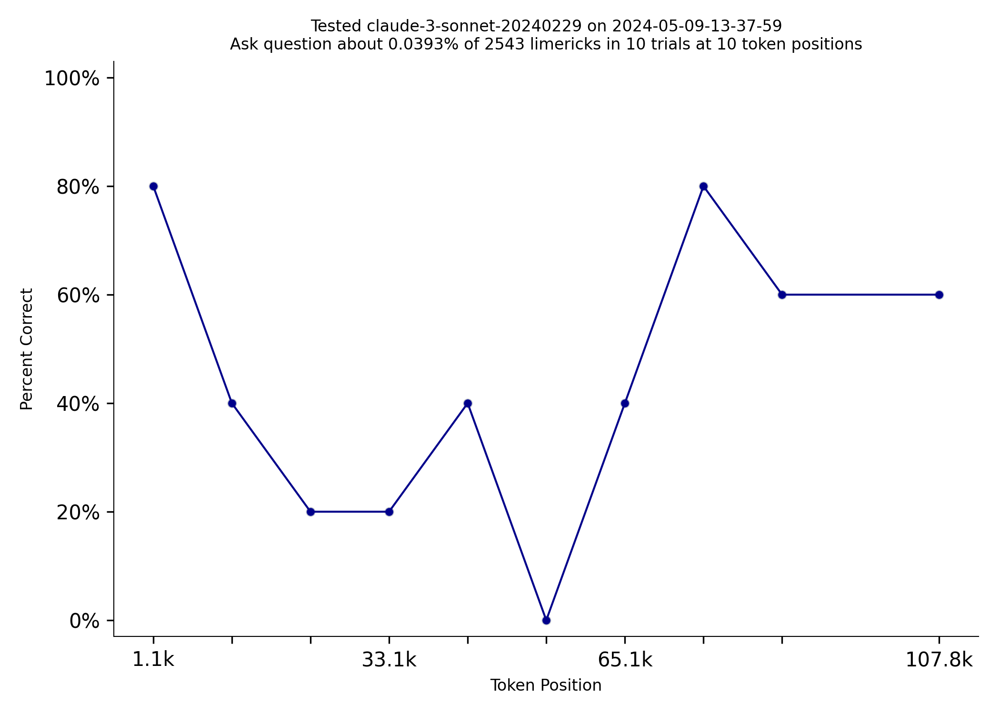

# Sonnet 3.5 does much better at NIAN than Sonnet 3.0
*by [Tom Burns](mailto:public@llmonpy.ai)*   
Needle in a Needlestack is a new benchmark to measure how well LLMs pay attention to the information in their context
window.  NIAN creates a prompt that includes thousands of limericks and the prompt asks a question about one limerick
at a specific location.  Here is an example prompt that [includes 2500ish limericks.](1/prompt.txt)  I tested the just released
Sonnet 3.5 on NIAN, and it did much better than 3.0:   

|  |  |
|:---------------------------------:|:-------------------------------------:|
|            Sonnet 3.0             |              Sonnet 3.5               |

  
However, Google's Gemini Pro costs about the same as Sonnet 3.5, but Gemini does dramatically better on NIAN.    

|  |  |
|:--------------------------------------------:|:-------------------------------------:|
|                Gemini Pro 1.5                |              Sonnet 3.5               |
  
The [code for this benchmark is here.](https://github.com/llmonpy/needle-in-a-needlestack)  It should be
easy to add support for additional models.  You can [read more about how answers are evaluated and questions are
vetted on the methodology page](https://nian.llmonpy.ai/methodology).  If you have any questions, please [contact me](mailto:public@llmonpy.ai)